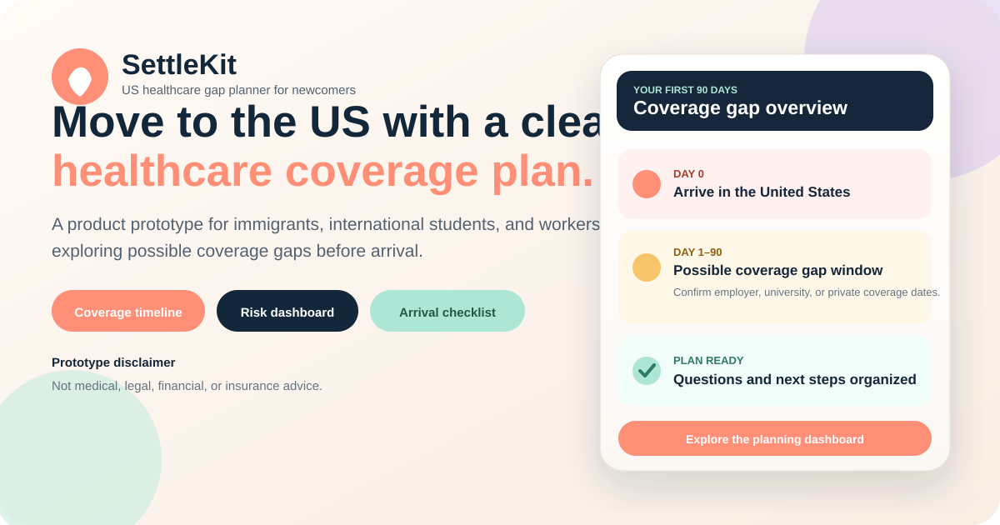
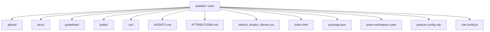
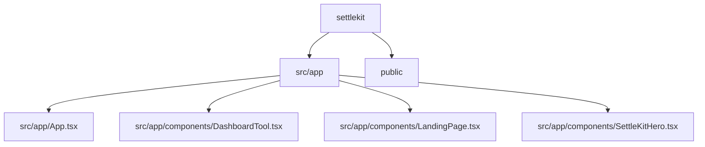
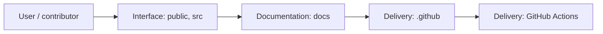
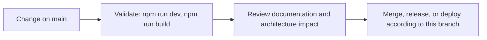
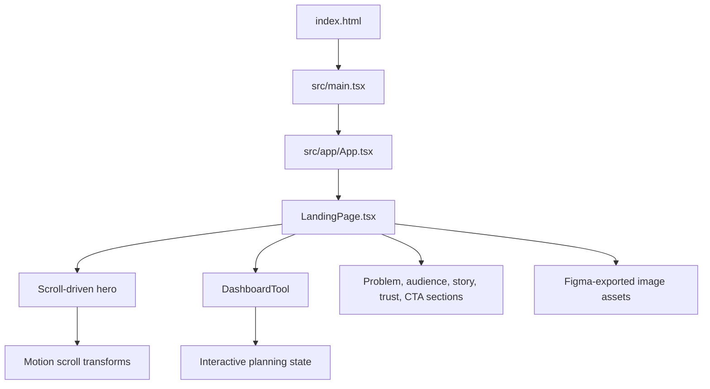

<div align="center">



# SettleKit

<!-- interactive-readme-standard:start -->

> [!NOTE]
> **Branch-specific documentation:** this section is maintained for [`main`](https://github.com/Nischhalsubba/settlekit/tree/main). It is generated from the files present on this branch and preserves the project-authored README below.

<details open>
<summary><strong>Interactive repository guide</strong></summary>

## Branch overview

| Item | Value |
|---|---|
| Repository | [`Nischhalsubba/settlekit`](https://github.com/Nischhalsubba/settlekit) |
| Branch | [`main`](https://github.com/Nischhalsubba/settlekit/tree/main) |
| Detected stack | Vite, Tailwind CSS, TypeScript, CSS, HTML, JavaScript |
| Detected manifests | package.json |
| Documentation policy | Every maintained branch must explain purpose, setup, structure, architecture, flows, testing, delivery, security, and ownership. |

## Repository structure



The diagram is generated from the branch's actual top-level files and directories. Use the branch link above for complete source navigation.

## Website or application structure



## Application and responsibility flow



## Change-to-delivery flow



## README requirements for this branch

- Explain what this branch contains and how it differs from the default branch.
- Keep installation, configuration, usage, testing, deployment, security, support, and license information accurate.
- Document repository, website or application, API, data, authentication, background-job, and deployment flows when they exist.
- Prefer Mermaid diagrams and expandable `<details>` sections for visual navigation.
- Link diagrams and modules to real source paths; never invent missing components.
- Preserve project-specific documentation and update diagrams whenever architecture or major paths change.
- Treat secrets, private infrastructure, customer data, and credentials as prohibited README content.

</details>

<!-- interactive-readme-standard:end -->

### A healthcare coverage-gap planning prototype for immigrants, international students, and workers moving to the United States.

<p>
  
  
  
  
  
</p>

[Overview](#overview) · [Features](#features) · [Architecture](#architecture) · [SEO](#seo-and-discoverability) · [Setup](#getting-started) · [Risks](#medical-legal-and-evidence-risks) · [Roadmap](#roadmap)

</div>

---

> [!IMPORTANT]
> **SettleKit is a product and interface prototype. It does not provide medical, legal, financial, immigration, tax, or insurance advice.** Coverage rules, eligibility, prices, effective dates, waiting periods, exclusions, and legal requirements must be verified with official sources and qualified professionals.

## Overview

**SettleKit** is an interactive planning concept for people preparing to move to the United States who may face a delay before employer, university, or private health coverage begins.

The experience is designed around a practical newcomer problem:

> “What happens between the day I arrive and the day my health coverage actually starts?”

The prototype combines a scroll-driven landing page with a healthcare planning dashboard that helps users explore possible coverage timing, risk exposure, and preparation steps before travel.

### Intended audience

- International students moving to the United States
- Skilled workers relocating on employment visas
- Immigrants and newcomers preparing for arrival
- Families helping someone plan an international move

## Product direction

SettleKit is positioned as a **planning and education layer**, not an insurer, broker, medical service, or legal advisor.

The product concept aims to help users:

- understand that coverage may not begin on arrival
- map a possible first-30, first-60, or first-90-day gap
- organize questions for employers, universities, insurers, and advisors
- compare broad preparation scenarios
- avoid discovering important coverage details only after an emergency

## Features

<table>
  <tr>
    <td width="50%" valign="top">
      <h3>Scroll-driven product story</h3>
      <p>The landing page transitions from problem framing into the planning dashboard through an animated, sticky hero experience.</p>
    </td>
    <td width="50%" valign="top">
      <h3>Healthcare planning dashboard</h3>
      <p>An embedded tool concept demonstrates how users could review arrival timing, possible coverage gaps, risk, and next steps.</p>
    </td>
  </tr>
  <tr>
    <td width="50%" valign="top">
      <h3>Newcomer-focused timeline</h3>
      <p>The interface frames the first days and months after arrival as a timeline rather than a wall of insurance terminology.</p>
    </td>
    <td width="50%" valign="top">
      <h3>Responsive marketing experience</h3>
      <p>Navigation, content sections, dashboard transitions, cards, and calls to action adapt across desktop and mobile layouts.</p>
    </td>
  </tr>
</table>

### Current page sections

- Primary healthcare-gap hero
- Interactive dashboard transition
- Statistics bar
- Coverage-gap problem framing
- First-90-days timeline
- Audience and use-case sections
- Product explanation
- Testimonials and trust-style sections
- Calls to action
- Responsive mobile navigation

## Important prototype caveat

The current interface includes marketing-style claims such as user counts, percentage outcomes, savings figures, and testimonials.

These should be treated as **placeholder product copy unless backed by verifiable research or production analytics**.

Before public launch, every claim should be:

- sourced
- dated
- reproducible
- reviewed for legal and compliance risk
- presented with appropriate context

## Architecture



### Main files

| Path | Purpose |
|---|---|
| `index.html` | Page metadata, structured data, crawlable summary, and application root |
| `src/main.tsx` | React entry point |
| `src/app/App.tsx` | Top-level application component |
| `src/app/components/LandingPage.tsx` | Landing page, navigation, scroll experience, and marketing sections |
| `src/app/components/DashboardTool.tsx` | Interactive healthcare planning dashboard |
| `src/styles/index.css` | Tailwind and global styles |
| `docs/images/settlekit-readme-hero.svg` | Repository and social-preview visual |
| `public/robots.txt` | Crawler policy |
| `public/llms.txt` | AI-readable project summary and disclaimer |

## Technology stack

| Layer | Technology | Purpose |
|---|---|---|
| Build tool | Vite `6.3.5` | Development server and production build |
| UI runtime | React `18.3.1` | Interactive product interface |
| Styling | Tailwind CSS `4.1.12` | Responsive layout and visual system |
| Motion | Motion `12.23.24` | Scroll transforms, transitions, and reveal effects |
| Component primitives | Radix UI | Accessible interactive primitives |
| UI library | MUI `7.3.5` | Supplemental components and icons |
| Forms | React Hook Form | Form-state support |
| Charts | Recharts | Dashboard visualization support |
| Icons | Lucide React | Interface iconography |

## Design system

The interface uses a friendly, newcomer-oriented visual language rather than the visual tone of an insurance portal.

### Core colors

| Token | Value |
|---|---|
| Coral | `#ff8f77` |
| Navy | `#13273a` |
| Warm surface | `#faf7f2` |
| Peach accent | `#fee3c1` |
| Mint success | `#aee6d6` |
| Lilac | `#cdb9ef` |

### Design principles

- explain before asking
- reduce healthcare jargon
- use timelines and scenarios
- preserve strong visual hierarchy
- keep calls to action reassuring rather than alarming
- clearly distinguish educational planning from professional advice

## SEO and discoverability

The original repository described the project only as “Dashboard Hero Component Design,” which concealed its actual subject and search intent.

The application now targets relevant topics such as:

- US healthcare gap planner
- immigrant health insurance planning
- international student insurance gap
- newcomer healthcare in the USA
- visa healthcare preparation
- moving to the US health insurance planning

### Implemented SEO features

- descriptive page title
- product-focused meta description
- crawl directives
- Open Graph metadata
- Twitter/X metadata
- `SoftwareApplication` JSON-LD
- visible application heading
- crawler-readable product summary
- explicit medical, legal, financial, and insurance disclaimer
- `robots.txt`
- `llms.txt`
- descriptive repository hero with accessible SVG metadata

### Still required before public deployment

- confirmed production domain
- canonical URL
- absolute social-image URLs
- sitemap
- Google Search Console verification
- Bing Webmaster Tools verification
- production analytics
- evidence review for all marketing claims
- legal review for healthcare and insurance wording

## Getting started

### Install

```bash
git clone https://github.com/Nischhalsubba/settlekit.git
cd settlekit
npm install
```

### Run locally

```bash
npm run dev
```

Vite will display the local development URL in the terminal.

### Create a production build

```bash
npm run build
```

The compiled output will be written to:

```text
dist/
```

## Medical, legal, and evidence risks

This product sits near healthcare, insurance, immigration, and financial-risk decisions. That creates stricter accuracy requirements than an ordinary landing page.

### High-risk content areas

- claims about insurance waiting periods
- visa-specific eligibility claims
- cost estimates for emergency care or hospitalization
- claims about average coverage start dates
- recommendations for short-term health products
- statements about university or employer obligations
- savings or debt-prevention claims
- user outcome percentages
- testimonials presented as real evidence

### Required safeguards

Before any public release:

1. Source every factual claim from current authoritative material.
2. Display dates and jurisdiction where relevant.
3. Avoid personalized insurance recommendations unless legally permitted.
4. Provide clear escalation to qualified professionals.
5. Separate educational scenarios from advice.
6. Review privacy implications before collecting health, visa, employment, or financial information.
7. Never imply guaranteed coverage, savings, approval, or eligibility.

## Testing checklist

### Functional QA

- [ ] Scroll-driven hero works with mouse, trackpad, touch, and keyboard.
- [ ] Navigation correctly scrolls to page sections.
- [ ] Mobile menu opens, closes, and traps no focus.
- [ ] Dashboard remains usable on small screens.
- [ ] Motion respects `prefers-reduced-motion`.
- [ ] Calls to action do not imply a live service when the product is still a prototype.
- [ ] External links and forms clearly communicate their status.

### SEO QA

- [ ] Production title and description match visible content.
- [ ] Canonical URL points to the final production domain.
- [ ] Social image uses an absolute production URL.
- [ ] Structured data validates.
- [ ] Sitemap lists only public canonical pages.
- [ ] Search crawlers can access rendered text.
- [ ] Claims are not hidden solely inside animated states.

### Trust and compliance QA

- [ ] Every numeric claim has a source.
- [ ] Testimonials are real, approved, and attributable.
- [ ] Medical and insurance disclaimers are visible.
- [ ] Privacy policy exists before collecting personal data.
- [ ] Terms explain prototype versus service status.
- [ ] Contact and escalation information is accurate.

## Known limitations

- The repository is currently a frontend prototype.
- No confirmed production domain is exposed.
- Authentication buttons are presentation-only unless connected elsewhere.
- The dashboard should not be assumed to use real insurer or government data.
- Prototype metrics and testimonials are not automatically verified evidence.
- The application currently relies on Figma-exported asset imports.
- There are no automated tests or lint scripts defined in `package.json`.

## Roadmap

- [ ] Replace placeholder metrics and testimonials with sourced content.
- [ ] Add a verified production domain.
- [ ] Add canonical metadata and sitemap.
- [ ] Add reduced-motion fallbacks.
- [ ] Add automated accessibility tests.
- [ ] Add unit tests for dashboard logic.
- [ ] Add source citations for coverage rules and costs.
- [ ] Add jurisdiction and visa-type qualification.
- [ ] Add privacy policy, terms, and data-retention documentation.
- [ ] Add secure backend architecture only after data requirements are defined.
- [ ] Conduct legal and insurance-compliance review.

## Maintainer

**Nischhal Raj Subba**

Product design, interaction design, frontend implementation, and repository direction.

## Disclaimer

SettleKit is a product prototype. It is not an insurance company, broker, healthcare provider, law firm, immigration advisor, financial advisor, or government service. Nothing in this repository should be interpreted as professional advice or a guarantee of coverage, eligibility, cost, or outcome.
